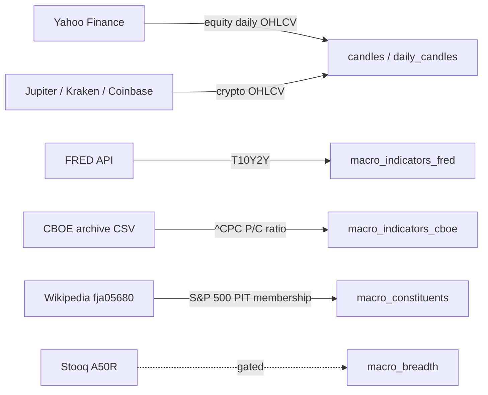

# 01 — Data Ingestion

> **What it does.** Pulls raw OHLCV bars + macro indicators + S&P 500 constituent history from external sources into [[02 - Storage (ClickHouse)|ClickHouse]]. Everything downstream — backtests, regime classifier, daemon — reads from CH, not the network.

## Source map

## Scripts

| Source | Script | npm command |
|---|---|---|
| Equity daily | [scripts/fetch_daily_yfinance.py](../../scripts/fetch_daily_yfinance.py) | — (called by `macro:ingest`) |
| FRED | [scripts/fred_ingest.py](../../scripts/fred_ingest.py) | `npm run fred:ingest` |
| CBOE | [scripts/cboe_putcall_ingest.py](../../scripts/cboe_putcall_ingest.py) | `npm run cboe:ingest -- --from-file <path>` |
| S&P 500 constituents | [scripts/macro_refresh_constituents.py](../../scripts/macro_refresh_constituents.py) | `npm run macro:refresh-constituents` |
| Constituent history backfill | [scripts/macro_backfill_constituent_histories.py](../../scripts/macro_backfill_constituent_histories.py) | `npm run macro:ingest:breadth-only` |
| Breadth compute (% > MA200) | [scripts/macro_compute_breadth.py](../../scripts/macro_compute_breadth.py) | `npm run macro:compute-breadth` |
| Macro candles (VIX/HYG/SPY…) | [scripts/macro_regime_ingest.py](../../scripts/macro_regime_ingest.py) | `npm run macro:ingest` |
| Jupiter (Solana DEX) | [scripts/jupiter_backfill.ts](../../scripts/jupiter_backfill.ts) | `npm run backfill:jupiter` |
| Kraken (CEX) | [scripts/kraken_backfill.ts](../../scripts/kraken_backfill.ts) | `npm run backfill:kraken` |
| Coinbase (CEX) | [scripts/coinbase_backfill.ts](../../scripts/coinbase_backfill.ts) | `npm run backfill:coinbase` |

## Watch-outs

- **CBOE 2019-present is dark.** The free archive ends 2019-10-04. Closing the gap requires CBOE DataShop (paid) or a licensed vendor. See [[04 - Regime Classifier (phase1_v3)]] for the operational impact.
- **Stooq breadth path is gated.** `^A50R` is captcha-apikey-gated since 2026-05-09; needs `STOOQ_APIKEY` env var. Currently routes through the Wikipedia/fja05680 constituent-history path instead.
- **Parser footgun.** `cboe_putcall_ingest.py` previously had `TOTAL` in its column candidate list and could silently store volume (millions) as a ratio. Tightened in session 44; regression test locks it in (`scripts/tests/test_cboe_putcall_ingest.py`).
- **Phantom candles API is session-auth-bound.** Not suitable for sustained backfills — use Hyperliquid's L1 API for HL data instead.

## How freshness is maintained

The daily daemon (`npm run daemon:daily` — see [[06 - Daemon (daily cadence)]]) invokes:

- `[macro-fetch]` step → `macro:ingest --skip-breadth --start <date>` to refresh VIX / VIX3M / HYG / SPY / LQD / TLT candles.
- The S&P 500 mid-cap universe gets refreshed on the same cycle.

Backfill (history beyond the daily window) is operator-triggered, one-shot, via the explicit `backfill:*` scripts.
