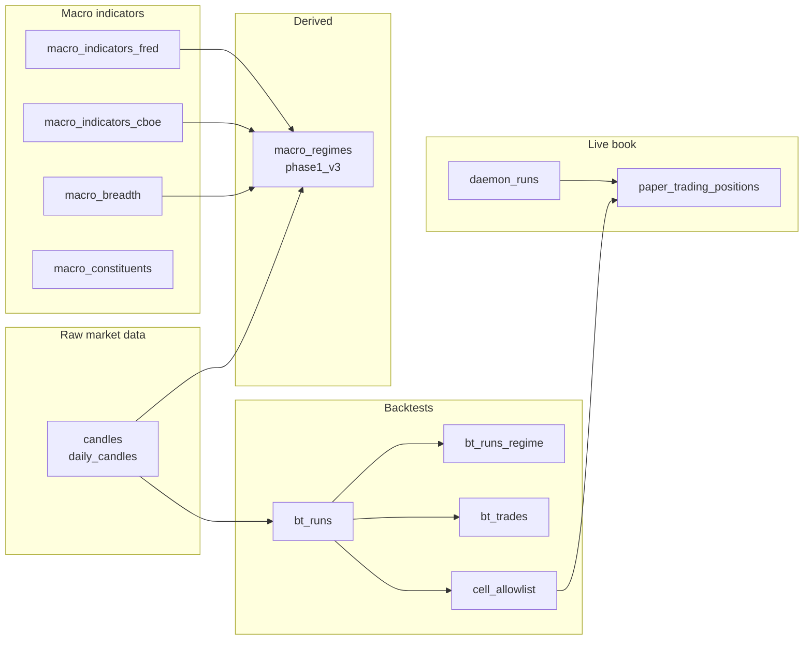

# 02 — Storage (ClickHouse)

> **What it is.** Every piece of state SignalForge persists lives in the `quantlab.*` schema on a local ClickHouse instance. Everything else is derived. Schema bootstrap runs at `npm run dev` startup via [src/server/clickhouse.ts](../../src/server/clickhouse.ts) — `bootstrapClickHouseSchema()`.

## Table map



## Table reference

| Table | Writer | Reader | Notes |
|---|---|---|---|
| `candles` (intraday) | `*_backfill.ts` · daemon | backtest engine · regime classifier | `ReplacingMergeTree(ingested_at)`. Query with `FINAL`. |
| `daily_candles` | `fetch_daily_yfinance.py` · `macro_regime_ingest.py` | regime classifier · brief | Equity daily bars. |
| `macro_indicators_fred` | `fred_ingest.py` | regime classifier · diagnostics | `series_id='T10Y2Y'`. |
| `macro_indicators_cboe` | `cboe_putcall_ingest.py` | regime classifier (when activated) | 4,018 rows 2003-2019, **structurally dormant** (see [[04 - Regime Classifier (phase1_v3)|classifier]]). |
| `macro_constituents` | `macro_refresh_constituents.py` | breadth compute | PIT S&P 500 membership from Wikipedia. |
| `macro_breadth` | `macro_compute_breadth.py` | regime classifier | % > MA200, adv/dec ratios. |
| `macro_regimes` | `macro_regime_backfill.ts` · `macro_regime_classify_today_v3.ts` | gates · dashboard · brief | One row per (trade_date, classifier_version). |
| `bt_runs` | `batch_backtest.ts` | scoring · allowlist promo | One row per (strategy, param, ticker, interval, run_id). |
| `bt_runs_regime` | `backfill_bt_runs_regime.ts` | regime-attribution UI | Joins `bt_runs` with regime at trade time. |
| `bt_trades` | `batch_backtest.ts --persist-trades` | meta-labeling · diagnostics | Per-trade rows. |
| `cell_allowlist` | `populate_cell_allowlist.ts` | [[05 - Trade Execution Pipeline\|Gate 1]] · daemon · audit | Promoted (strategy, param, ticker) cells. |
| `paper_trading_positions` | daemon | review · brief · audit | Live book. State ∈ {open, flat}. |
| `daemon_runs` | daemon | brief · Track-A counter | One row per daemon execution. |
| `strategy_meta_models` | `build_meta_train_set.ts` | [[05 - Trade Execution Pipeline\|Gate 3]] (deferred) | ML meta-labeler artifacts. |

## Engine choice

Most tables use `ReplacingMergeTree(ingested_at)` so re-ingestion is idempotent. **Always query with `FINAL`** when correctness matters — the merge is asynchronous.

```sql
SELECT * FROM quantlab.macro_indicators_cboe FINAL WHERE observation_date = today();
```

## Schema migrations

⚠️ Migrations are bootstrap-only (`src/server/clickhouse.ts:730-777`) — they run when `npm run dev` starts the server. There is no separate migrations folder. Heavy `ALTER` operations should be done in a dedicated maintenance pass before bumping `npm run dev`.

See `.claude/HANDOFF.md` "Watch-outs" for the running list of bootstrap-only ALTERs.

## Probes (copy-paste)

```sql
-- v3 regime distribution (must match ADR_038_BASELINE)
SELECT regime, count() FROM quantlab.macro_regimes FINAL
WHERE classifier_version = 'phase1_v3' GROUP BY regime ORDER BY regime;

-- Today's regime
SELECT trade_date, regime, categories_firing,
       yield_curve_inverted, credit_stress, risk_off_rotation,
       sentiment_extreme, vix_term_inverted, hyg_spy_divergence
FROM quantlab.macro_regimes FINAL
WHERE classifier_version = 'phase1_v3' AND trade_date = today();

-- Allowlist sizes
SELECT bundle_id, count() FROM quantlab.cell_allowlist GROUP BY bundle_id;
```
