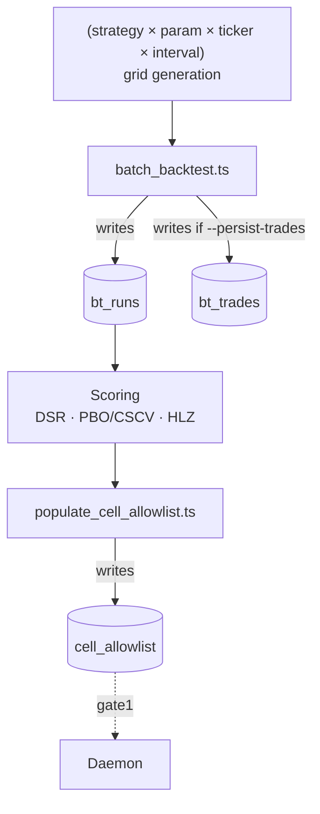

# 03 — Backtest Engine

> **What it does.** Sweeps every (strategy × parameter × ticker × interval) cell against historical [[02 - Storage (ClickHouse)|candles]], scores each cell with overfitting-corrected metrics, then promotes the survivors into the [[02 - Storage (ClickHouse)|`cell_allowlist`]] table that powers [[05 - Trade Execution Pipeline|Gate 1]].

## Flow



## Strategies (registry)

Strategies live in [scripts/strategies/](../../scripts/strategies/) and are registered against [src/lib/indicators.ts](../../src/lib/indicators.ts). Active families:

| Family | Idea | Where |
|---|---|---|
| `mean_reversion_v1` (`mr_v1`) | RSI-based reversion in oversold/overbought zones | [scripts/strategies/mean_reversion_v1.ts](../../scripts/strategies/mean_reversion_v1.ts) |
| `trend_v1` | Breakout + trend-following | [scripts/strategies/trend_v1.ts](../../scripts/strategies/trend_v1.ts) |
| `volume_breakout_v1` / `..._xmom_v1` | Volume-anomaly breakout | [scripts/strategies/volume_breakout_v1.ts](../../scripts/strategies/volume_breakout_v1.ts) |
| `xsmom` (cross-sectional momentum) | Basket long-short on lookback decile | [scripts/batch_backtest_xsmom.ts](../../scripts/batch_backtest_xsmom.ts) |

## Sweep commands

```bash
npm run backtest              # 5m/15m/1h/1d × coarse grid · split-pct 70 (default)
npm run backtest:full         # full grid + --persist-trades
npm run backtest:smoke        # 1h · 10 tokens · sanity check
npm run backtest:1h           # 1h only
npm run backtest:xsmom        # cross-sectional momentum sweep
```

Per-cell parameters:

- `--split-pct 70` — 70% in-sample, 30% out-of-sample for walk-forward OOS.
- `--min-trades-persist 10` — drop cells with too few trades to score.
- `--min-token-history-days 90` — drop tokens without enough history.

## Scoring (overfitting correction)

The raw sweep produces inflated metrics — many strategies look profitable by luck across thousands of cells. Scoring layers fix this:

| Method | File | Source |
|---|---|---|
| **Deflated Sharpe Ratio (DSR)** | [src/lib/psr.ts](../../src/lib/psr.ts) | Bailey & López de Prado (2014) |
| **PBO via CSCV** (Probability of Backtest Overfitting) | [src/lib/cscv.ts](../../src/lib/cscv.ts) | Bailey, Borwein, LdP, Zhu (2014) |
| **HLZ multiple-testing haircut** | [src/lib/hlzHaircut.ts](../../src/lib/hlzHaircut.ts) | Harvey, Liu, Zhu (2016) |
| **Slice metrics** (regime, year, drawdown) | [src/lib/sliceMetrics.ts](../../src/lib/sliceMetrics.ts) | — |

📘 See [[99 - Glossary]] for intuition on each.

## Allowlist promotion

[scripts/populate_cell_allowlist.ts](../../scripts/populate_cell_allowlist.ts) picks the surviving cells per bundle (`mean_reversion_v1`, `trend_v1`) and writes them into `cell_allowlist`. Current sizes:

| Bundle | Tickers |
|---|---|
| `mean_reversion_v1` | 52 |
| `trend_v1` | 106 |

These are the only cells that can pass [[05 - Trade Execution Pipeline|Gate 1]].

## Worker model

`batch_backtest.ts` spawns `batch_backtest_worker.ts` processes (one per CPU on a 9950X by default) and shards the grid across them. Memory pressure is the main bottleneck on the 64GB workstation — keep `--max-tokens` in mind for large sweeps.

## Watch-outs

- **Selection bias is the silent killer.** Raw Sharpe of 3 across a 10,000-cell sweep is usually overfit. DSR + PBO + HLZ haircut are non-optional; never rank on raw Sharpe.
- **`bt_trades` fallback path produces zero rows in current corpus** — flagged in HANDOFF "Watch-outs". Investigate before relying on per-trade analytics from the latest sweep.
- **`trend_v1/p=30` is near coin-flip; `mr_v1/p=14` has real edge.** (HANDOFF carry — don't expect symmetric performance between the two bundles.)
