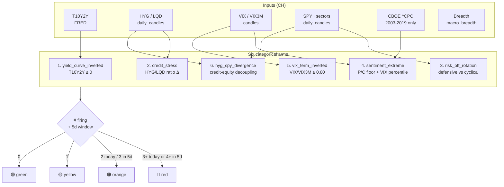

# 04 — Regime Classifier (phase1_v3)

> **What it does.** Produces one row per trading day in [[02 - Storage (ClickHouse)|`macro_regimes`]] labelling the market as **🔴 red · 🟠 orange · 🟡 yellow · 🟢 green** based on how many of six risk-off categories are firing. This label feeds [[05 - Trade Execution Pipeline|Gate 2]] of the trade-execution pipeline.
>
> **Spec:** [docs/specs/macro-regime-classifier-phase1_v3.md](../specs/macro-regime-classifier-phase1_v3.md) · **Code:** [src/server/macro_regime_v3.ts](../../src/server/macro_regime_v3.ts)

## The six categories



## ADR-038 baseline (session 45 re-pin)

After the session-45 controlled rerun of `npm run macro:backfill:v3`, the corpus distribution (2008-01-02 → 2026-05-15, 4622 rows) is pinned to:

| Regime | Count |
|---|---|
| 🔴 red | **127** |
| 🟠 orange | **349** |
| 🟡 yellow | **1,392** |
| 🟢 green | **2,754** |

📍 Constant lives at [src/server/regime_dashboard.ts](../../src/server/regime_dashboard.ts) `ADR_038_BASELINE`. Test #9b in [scripts/tests/regimeDashboard.test.ts](../../scripts/tests/regimeDashboard.test.ts) enforces it byte-equal — any threshold tune that shifts the distribution **must** update both in the same PR.

## Key thresholds

| Constant | Value | Where | Why |
|---|---|---|---|
| `VIX_TERM_COMPLACENCY_FLOOR` | `0.80` | [src/server/macro_regime_v3.ts](../../src/server/macro_regime_v3.ts) | Empirical p05 of VIX/VIX3M close-close ratio. Below ~0.78 the arm goes dormant. |
| `PUT_CALL_FEAR_HIGH` | `1.15` | classifier | Sentiment-extreme fear ceiling (5d MA). Empirically validated at p95 in s78 (5.46% fire rate, per-regime stability 4.75-6.73%) — unchanged from Tier 0. |
| `PUT_CALL_COMPLACENCY_LOW` | `0.77` | classifier | Sentiment-extreme complacency floor (5d MA). Was `0.65` Tier 0 (fired 0.17% — dormant); retuned in s78 to corpus p05 round = 0.77 (~5% tail). Live for the 2003-2019 archive window since s79 `macro:backfill:v3` joined CBOE into `macro_regimes`; 2019+ ingest remains DataShop-gated. |

## CBOE coverage caveat

- **2003-2019:** 4,018 daily `^CPC` rows ingested in session 44 (Recent OCC-cleared + Archive preliminary CSVs, deduped by `ReplacingMergeTree(ingested_at)`).
- **2019-present:** dark. CBOE deprecated the free CDN URL; closing the gap requires DataShop or a licensed vendor.

The classifier handles the gap by **fail-soft**: when CBOE data is missing, the `sentiment_extreme` arm relies on VIX/VIX3M alone. This is uniform across the corpus today — see [[99 - Glossary]] for why mid-corpus mode shifts are a problem for baselines.

## Phase 9 candidates (queued, not authorised)

Future arms documented in [docs/specs/regime-classifier-phase9-candidates.md](../specs/regime-classifier-phase9-candidates.md):

| Candidate | Source | Citation |
|---|---|---|
| Margin debt growth rate | FINRA monthly | Goyal-Welch (2008) |
| Aggregate short interest ΔROC | FINRA biweekly | Diether-Lee-Werner (2009) |
| CFTC COT positioning | CFTC weekly | Wang (2001) |
| ETF flow divergence | daily | Ben-David et al. (2018) |

A persistent amber banner in [[08 - Dashboard UI|RegimeApp]] reminds operators these exist; the banner is intentionally non-dismissible.

## Runbook

```bash
# Today's regime row only (used by daemon):
npm run macro:classify:today:v3

# Full backfill (re-pins baseline — must update ADR_038_BASELINE in same PR):
npm run macro:backfill:v3

# Validate v3 unit tests:
node --import tsx --test scripts/tests/macroRegimeV3.test.ts
```

## Watch-outs

- **Don't run `macro:backfill:v3` casually** — it shifts the corpus distribution and trips test #9b. The session-44 PUSHBACK lock was lifted in session 45 only because diagnostic confirmed CH rows had drifted from the classifier.
- **The session-41 boundary test** relies on IEEE-754 exact equality of `16/20 == 0.80`. Future floor tunes need an IEEE-754-clean VIX close pair.
- **Polarity flip in the dashboard banner is load-bearing** — v2 was labelled "biased", v3 is labelled "immune". Test #10b enforces.
