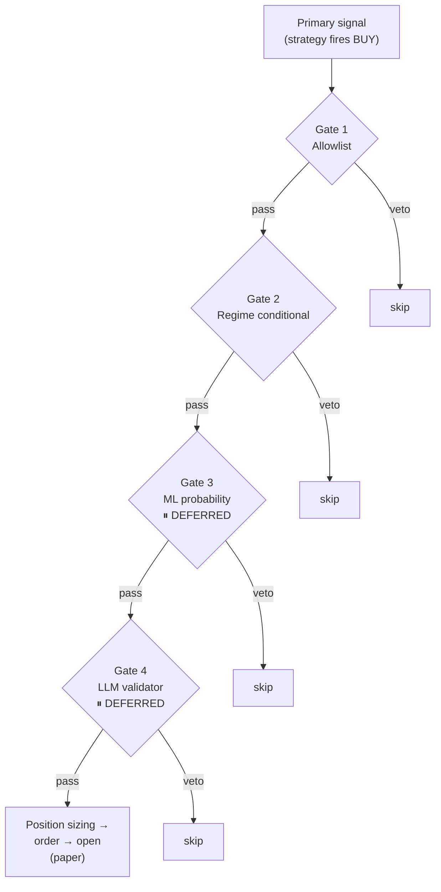
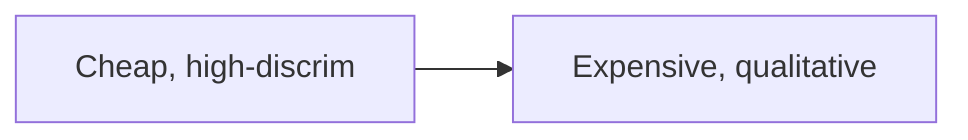

# 05 — Trade Execution Pipeline

> **What it is.** A four-gate veto chain between a strategy's "BUY" signal and a real position open. Each gate is a **hard veto**; failing any gate skips the entry. Gates fire cheapest → most expensive.
>
> **Spec:** [docs/specs/trade-execution-pipeline-architecture.md](../specs/trade-execution-pipeline-architecture.md)

## The four gates

## Status of each gate

| Gate | Cost | Source | Status |
|---|---|---|---|
| **1 — Backtest allowlist** | <1ms | [`quantlab.cell_allowlist`](02%20-%20Storage%20%28ClickHouse%29.md) | ✅ **LIVE** since session 38 |
| **2 — Regime conditional** | <10ms | `macro_regimes` (today) + `bt_runs_regime` | ✅ **LIVE** under [[04 - Regime Classifier (phase1_v3)\|phase1_v3]] since session 42 |
| **3 — ML probability (meta-labeling)** | ~100ms | `quantlab.strategy_meta_models` | ⏸ **DEFERRED ≥4 weeks** — ADR-027 showed lift −1.07pp on equity_midcap |
| **4 — LLM qualitative validator** | seconds + ~$0.01/check | Claude API + structured prompt | ⏸ **DEFERRED** — sequence-after sufficient allowlist OOS observation |

## Why this order

Cheapest filters fire first so most candidates never reach the expensive ones. Putting Gate 2 (regime) **before** Gate 3 (ML) means the meta-labeler — trained per regime — doesn't burn inference on candidates that already failed regime conditions.

## Existing positions are NOT force-closed by the gates

The gates govern **new entries** only. Strategy-defined exits (stop-loss, take-profit, signal reversal) continue to apply to open positions. An operator audit (`audit_positions.ts`) surfaces positions on tickers no longer on the allowlist so the human can decide whether to close.

Currently there are **24 violations** on the live book (3 mr_v1 + 21 trend_v1) — all in profit, awaiting operator judgment per HANDOFF "Open questions / HIGH".

## Code paths

| Gate | Implementation |
|---|---|
| Gate 1 | Lookup in `daily_signal_daemon.ts` against `cell_allowlist` |
| Gate 2 | Today's regime row joined against `bt_runs_regime` conditions |
| Gate 3 | Stubbed — see [docs/specs/adr-017-meta-labeling.md](../specs/adr-017-meta-labeling.md) |
| Gate 4 | Stubbed — `docs/specs/trade-execution-pipeline-architecture.md` §6 |

## Watch-outs

- **Gate 2 unlocks** were a multi-session journey — the v2 classifier was colourblind to red; v3 (Sharadar OR fja05680 breadth path) made the gate meaningful. See [[04 - Regime Classifier (phase1_v3)]].
- **`strategy_type` vs `bundleId`** — Gate 1 lookup uses `bundleId` from `PaperTradingResponse.cells[]`, which equals `strategy_type` for the equity cells. The operator-facing labels are `mr_v1` / `trend_v1`; don't confuse them.
- **24 carried allowlist violations** are NOT a regression — they're pre-existing positions awaiting operator close/let-ride decision. Tomorrow's daemon run will report the same list.
