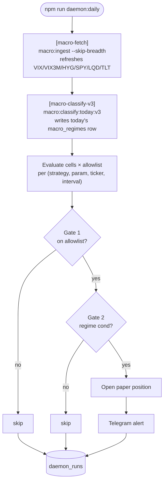

# 06 — Daemon (daily cadence)

> **What it is.** The scheduled job that runs the full pipeline once per market day: refresh data → classify regime → evaluate allowlisted cells → apply gates → emit positions + Telegram alert → log to `daemon_runs`.
>
> **Entry point:** [scripts/daily_signal_daemon.ts](../../scripts/daily_signal_daemon.ts) · **Run:** `npm run daemon:daily`

## Run sequence

## Variants

| Command | What it does |
|---|---|
| `npm run daemon:daily` | Production path — fetches data, writes CH, sends Telegram. |
| `npm run daemon:daily:dry` | `--dry-run --no-telegram` — full execution, no writes, no alerts. |
| `npm run daemon:daily:no-fetch` | Skip the data-fetch step (already refreshed). |

## What it writes

| Table | Rows | When |
|---|---|---|
| `candles` / `daily_candles` | Today's bars for the macro universe + S&P 500 mid-caps | `[macro-fetch]` step |
| `macro_regimes` | One row for `today()` under `classifier_version='phase1_v3'` | `[macro-classify-v3]` step |
| `paper_trading_positions` | New position rows (state='open'); flips state='flat' on exits | Per-cell evaluation |
| `daemon_runs` | One row per run with `NEW`/`EXIT`/`STALE` counts and timing | End of run |

## Track A — 30-day shakedown

The daemon's first run was **2026-05-11**. Track A counts elapsed trading days until two kill criteria flip from `insufficient_data` to actionable:

- **A4** — mr/trend P&L correlation > +0.7 ([src/server/paper_trading_kill_criteria.ts:108](../../src/server/paper_trading_kill_criteria.ts#L108))
- **A5** — 30-day cumulative P&L < −20% ([src/server/paper_trading_kill_criteria.ts:120](../../src/server/paper_trading_kill_criteria.ts#L120))

Both require ≥30 trading days. Today (2026-05-16) is **Day 3 of 30**. Verdict-flip target ≈ **2026-06-29 (Mon)**, accounting for Memorial Day (5/25), Juneteenth (6/19), and the 5/12 missed day. See [[07 - Paper Trading & Monitoring]] for the kill-criteria definitions.

## Watch-outs

- **The 5/12 gap is permanent.** `daemon_runs` shows no row for 2026-05-12 — projection accounts for this. Additional gaps will push the A4/A5 date out.
- **One Telegram alert per evaluated cell** when in production mode. Use `:dry` for development.
- **STALE count of 24** is the carried baseline (the 24 allowlist violations). Don't treat persistent STALE as a regression — see [[05 - Trade Execution Pipeline]] "Existing positions" note.
- **`STOOQ_APIKEY` env var is operationally inert** — the daemon doesn't use Stooq anymore (Wikipedia/fja05680 path covers breadth).
