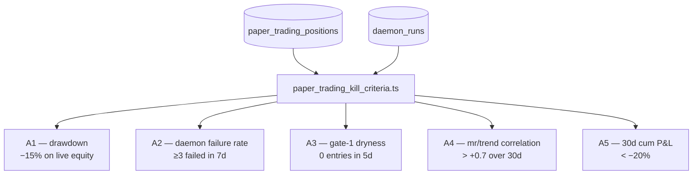

# 07 — Paper Trading & Monitoring

> **What it is.** The human-facing layer wrapped around the [[06 - Daemon (daily cadence)|daemon]]: a morning brief, position audit, per-cell P&L review, and an automated kill-criteria board that decides whether to keep trusting the live strategies.

## Day-glance trio

```bash
npm run daemon:daily                     # Telegram-emitting; fetches + evaluates
npm run audit:positions                  # stdout-only; flags non-allowlist positions
npx tsx scripts/_paper_trading_review.ts # stdout-only; per-cell unrealized + kill
npm run brief:morning                    # markdown brief with watch-list table
```

## Kill criteria (A1-A5)



Each verdict is one of `pass` · `fail` · `insufficient_data` · `n/a`. Code: [src/server/paper_trading_kill_criteria.ts](../../src/server/paper_trading_kill_criteria.ts).

| Criterion | Threshold | Active? |
|---|---|---|
| A1 — drawdown | −15% live equity | ✅ |
| A2 — daemon failure rate | ≥3 failed runs in 7d | ✅ |
| A3 — gate-1 dryness | 0 entries in 5d | ✅ |
| A4 — mr/trend P&L correlation | > +0.7 (needs ≥30 trading days) | ⏳ Day 3/30 |
| A5 — 30d cumulative P&L | < −20% (needs ≥30 trading days) | ⏳ Day 3/30 |

A4 + A5 flip from `insufficient_data` → actionable on **≈ 2026-06-29**. See [[06 - Daemon (daily cadence)]] for the projection details.

## Morning brief

```bash
npm run brief:morning
```

Renders a markdown brief to stdout — Vector Core's daily check-in:

- Regime banner (today's `macro_regimes` row, categories firing)
- Watch-list table with ✓/✗ Allowlist column
- Kill-criteria verdicts (5 rows, colour-coded)
- Open positions table with unrealized P&L

Code: [src/server/operator_brief.ts](../../src/server/operator_brief.ts) + [src/server/operator_brief_render.ts](../../src/server/operator_brief_render.ts).

## Position audit

```bash
npm run audit:positions             # report
npm run close:violations            # ⚠ destructive — operator-gated
```

`audit_positions.ts` lists positions whose `(strategy, ticker)` no longer appears in `cell_allowlist`. The auto-close trigger requires significant drawdown; **profitable** violations are surfaced for operator decision but not closed automatically.

Currently 24 violations (3 mr_v1 + 21 trend_v1), all in profit (+2.62% to +97% across the book). Operator paths:

| Path | Trade-off |
|---|---|
| Let ride under strategy exit logic | Respects default; preserves further upside |
| Close all 24 | Locks profit; backtest is dark for these cells so current P&L is regression-to-mean from bull tape |
| Close subset on judgment | Per-ticker review against backtest data; most work |

## Per-cell review

```bash
npx tsx scripts/_paper_trading_review.ts
```

Stdout markdown — per-cell unrealized P&L, trade count, kill-criteria summary. Operator scripts grep this output, so **byte-equal regression matters** if you edit the renderer.

## Watch-outs

- **24 violations is the baseline** until operator decides. Don't treat persistent STALE list as a regression.
- **Track A is Day 3 of 30** — kill criteria A4/A5 will produce `insufficient_data` for ~6 more weeks. Anyone reading the brief should know this is by design.
- **`close:violations` is destructive** and operator-gated. Never invoke autonomously.
