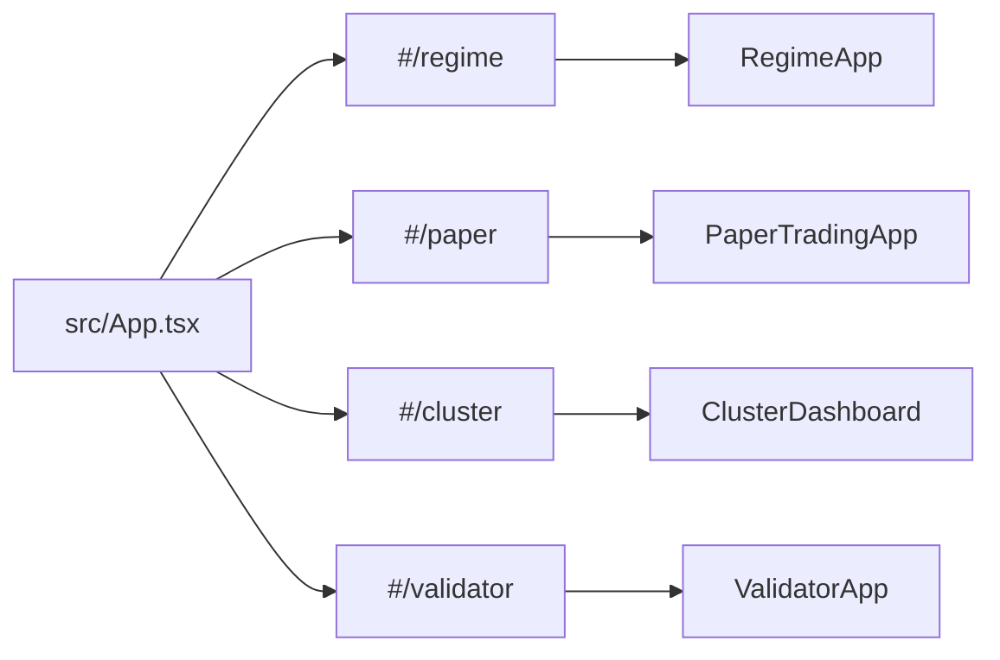

# 08 — Dashboard UI

> **What it is.** A React + Vite single-page app served by [server.ts](../../server.ts) at `http://localhost:3000`. Four hash-routed apps share the shell.

## Routes



## Apps

| Route | Component | Backed by | Purpose |
|---|---|---|---|
| `/#/regime` | [src/components/regime/RegimeApp.tsx](../../src/components/regime/RegimeApp.tsx) | [src/server/regime_dashboard.ts](../../src/server/regime_dashboard.ts) | Today's regime banner, category panels, distribution vs `ADR_038_BASELINE`. |
| `/#/paper` | [src/components/paperTrading/](../../src/components/paperTrading/) | [src/server/paper_trading_dashboard.ts](../../src/server/paper_trading_dashboard.ts) | Live book, kill-criteria board, P&L curve. |
| `/#/cluster` | [src/components/cluster/](../../src/components/cluster/) | [src/server/cluster_dashboard.ts](../../src/server/cluster_dashboard.ts) | Phase 2 behavioural clustering (HDBSCAN pockets). |
| `/#/validator` | [src/components/validator/](../../src/components/validator/) | (request handlers in `src/lib/validator*.ts`) | DSR / PBO / HLZ-haircut workbench for ad-hoc cell evaluation. |

Plus [src/components/metaLabeling/](../../src/components/metaLabeling/) for the deferred [[05 - Trade Execution Pipeline|Gate 3]] panel.

## Static doc

[MASTER.html](../../MASTER.html) lives at the repo root and renders the project roadmap (Phase 1 → Phase 9 → future candidates). It is served statically and **not** part of the React bundle. The amber Phase 9 banner in `RegimeApp` is a deliberately non-dismissible reminder that the candidate list exists.

## Charts

- **TradingView Lightweight Charts** — [src/components/TradingViewChart.tsx](../../src/components/TradingViewChart.tsx). Used for candle/equity overlays on the regime + paper-trading apps.
- **Recharts** for panel histograms / distributions (regime distribution, P&L curve).

## Run / develop

```bash
npm run dev        # http://localhost:3000 — runs server.ts (Express) + Vite dev
```

`npm run dev` also bootstraps the ClickHouse schema (see [[02 - Storage (ClickHouse)]] — migrations run at startup).

## Watch-outs

- **Smoke-testing UI changes** means actually opening the browser. Type checks and tests verify correctness, not visual feature integrity. CLAUDE.md operating rule.
- **The Phase 9 banner is intentional persistent UI.** If it ever needs to go away, that's a deliberate 3-line edit, not a bug.
- **Server.ts hot-restarts on file change**; the browser may need a full reload for some changes to ClickHouse query handlers.
