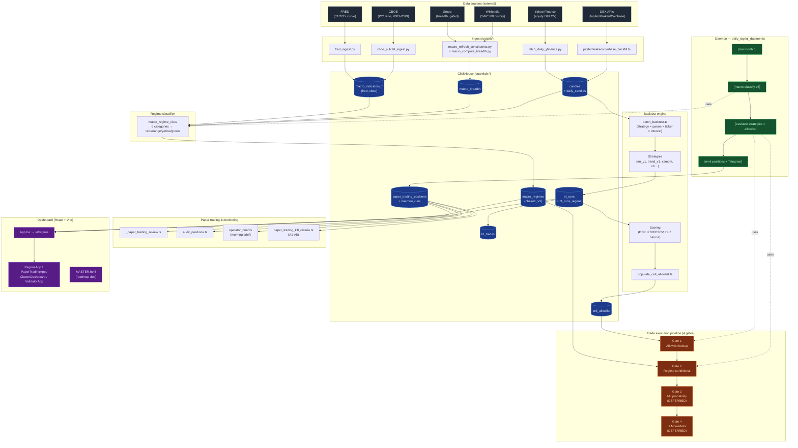

# SignalForge — Master Index

> **What this is.** A research-grade systematic trading lab. Backtests across thousands of (strategy × parameter × ticker × interval) cells, ranks them with overfitting-corrected metrics (Deflated Sharpe, PBO via CSCV), and routes the survivors through a 4-gate trade-execution pipeline that ends in paper-traded equity positions.
>
> **Read first.** [[README]] · `Architecture.canvas` (open in Obsidian) · [.claude/HANDOFF.md](../../.claude/HANDOFF.md)

## The full pipeline (end-state)

## Layers (top-down)

1. **[[01 - Data Ingestion]]** — pulling raw OHLCV + macro indicators + breadth from external sources into ClickHouse.
2. **[[02 - Storage (ClickHouse)]]** — the `quantlab.*` schema; who writes each table, who reads it.
3. **[[03 - Backtest Engine]]** — sweeping the (strategy × param × ticker × interval) grid; scoring with overfitting-corrected metrics; promoting survivors into the allowlist.
4. **[[04 - Regime Classifier (phase1_v3)]]** — a daily red/orange/yellow/green label on the macro tape, driven by 6 categorical risk-off arms.
5. **[[05 - Trade Execution Pipeline]]** — the 4-gate veto chain that decides whether a fresh "BUY" signal becomes a real position.
6. **[[06 - Daemon (daily cadence)]]** — the scheduled job that re-runs the pipeline every market day.
7. **[[07 - Paper Trading & Monitoring]]** — Track A live shakedown, kill criteria, morning brief, position audits.
8. **[[08 - Dashboard UI]]** — the React frontend that visualises all of the above.

## Working notes & playbooks

- **[[gaps/README|Gaps — Phase 9+ candidate components]]** — 8 cross-layer refinement candidates (strategy demotion, earnings calendar, drawdown response, capital deployment ramp, cross-strategy correlation, cross-asset signals, event-driven filings, executive departure). Documentation only; none authorized for build. Companion to the Layer-0-only [Phase 9 spec](../specs/regime-classifier-phase9-candidates.md).
- **[[symbol-analysis/README|Symbol Analysis Playbook]]** — 7-dimension worksheet methodology for evaluating any stock/ETF/fund: what-is-it, fundamentals, valuation, technicals, sentiment/options, structure, macro fit → decision framework. Use [[symbol-analysis/quick-screen|quick-screen]] for a 15-minute pass; duplicate [[symbol-analysis/worksheet-template|worksheet-template]] for a full analysis.

## North star

> _Deflated Sharpe of 1.2 with low PBO beats inflated PF of 3. Always._
>
> — Vector Core operating rule

Read [[99 - Glossary]] if any term in the diagram is unfamiliar.
