# Gaps — Phase 9+ Candidate Components

This folder documents components and refinements identified as future work, NOT current implementation targets. Each document captures a real gap in the current architecture along with proposed approach, dependencies, and rationale for deferral.

**Status:** All items are Phase 9+ candidates. Do not implement until Phases 5-8 ship and produce evidence.

**Origin:** Identified during architecture review on May 17, 2026. The current 5-layer system (regime classifier, primary strategies, universe filter, ML meta-labeling, Claude review) is structurally sound. These gaps are refinements, not foundational fixes.

## Gap inventory

| # | Document | Layer affected | Priority |
|---|----------|----------------|----------|
| 1 | `strategy-demotion.md` | Layer 1 (strategies) | High — prevents stale strategy accumulation |
| 2 | `earnings-calendar-integration.md` | Layer 4 (execution) | High — predictable risk currently unhandled |
| 3 | `drawdown-response-framework.md` → **SPEC'd** at [`docs/specs/drawdown-response-framework.md`](../../specs/drawdown-response-framework.md) | Operations | High — SPEC landed session 53; CODE pending (unblocks ADR-039 stage 3) |
| 4 | `cross-strategy-correlation.md` | Position sizing | Medium — matters at scale |
| 5 | `capital-deployment-ramp.md` | Operations | High — needed before June 29, 2026 paper trading completion |
| 6 | `cross-asset-signals.md` | Layer 0 (regime) | Medium — additional macro inputs |
| 7 | `event-driven-filings-processor.md` | Layer 2 (universe) | Medium — fast institutional signals |
| 8 | `executive-departure-signal.md` | Layer 2 (universe) | Low — implementable but lower value/effort ratio |
| 9 | `etf-flow-monitoring.md` | Layer 0 (regime) / Layer 2 (universe) | Medium — crowding signal; noisy at short horizons |
| 10 | `short-interest-tracking.md` | Layer 0 (regime sentiment) + Layer 2 (universe) | Medium — strong per-stock predictor, weak aggregate |
| 11 | `sector-rotation-monitoring.md` | Layer 0 (regime) | Medium — captures equity-internal regime shifts |
| 12 | `expanded-vol-structure.md` | Layer 0 (regime, refines `vix_term_inverted`) | Medium-High — cheapest gap to close; existing CBOE plumbing |
| 13 | `market-cycle-position.md` | Layer 0 (regime) + sector allocation guidance | High — robust academic foundation (Estrella-Mishkin); free data |

## Status overview

Done = the gap's first composite ships end-to-end (ingest → snapshot → daemon log
→ brief render) on real data. Active = SPEC drafted, code in-flight or partially
shipped. Deferred = ADR not yet drafted; lower priority.

```mermaid
flowchart LR
    subgraph done["Done — shipped end-to-end (s89–s95)"]
        g10[#10 short-interest]
        g8[#8 executive-departure]
        g9[#9 etf-flow]
        g7[#7 EK + F4 v1+v2]
        a41[ADR-041 yield_curve T10Y3M]
    end
    subgraph active["Active — code or SPEC in-flight"]
        g3[#3 drawdown-response]
        g5[#5 capital-deployment-ramp]
        g12[#12 expanded-vol-structure]
        g13[#13 market-cycle-position]
    end
    subgraph deferred["Deferred — Phase B-gated or low priority"]
        g1[#1 strategy-demotion]
        g2[#2 earnings-calendar]
        g4[#4 cross-strategy-correlation]
        g6[#6 cross-asset-signals]
        g11[#11 sector-rotation]
    end
    done -.->|unblocks Phase B independence test| active
    active -.->|enables broader rollout| deferred
```

> **See also:** [docs/_templates/mermaid-templates.md](../../_templates/mermaid-templates.md) for the canonical SignalForge Mermaid scaffolds (data flow, daemon stage, state machine, sequence, Gantt).

## Implementation principles when these eventually get built

1. **Build one at a time.** Validate independently before adding next.
2. **Each gap gets its own ADR** with rationale, data source, threshold calibration, and dependencies on prior phases.
3. **Apply standard deflation pipeline (DSR, PBO, HLZ)** to any composite that includes new components.
4. **Test independence from existing categories.** Highly correlated additions add no defense in depth — only redundancy.
5. **Informational-first before gating.** New components log decisions alongside trades; become hard filters only after 50+ trades validate predictive contribution.

## What NOT to build (rejected candidates)

Documented to prevent re-litigation:

- **Insider transactions at aggregate market level:** Weak predictive value per academic research.
- **Options dealer gamma positioning:** Useful but paid services with proprietary methodology; black box risk.
- **Hedge fund net exposure surveys:** Not publicly available systematically.
- **Real-time order flow as automated trigger:** Too noisy for systematic use without sophisticated filtering.
- **VC capital flows / private market positioning:** Genuine signal but paid data sources (PitchBook, Crunchbase, CB Insights); revisit if budget permits.
